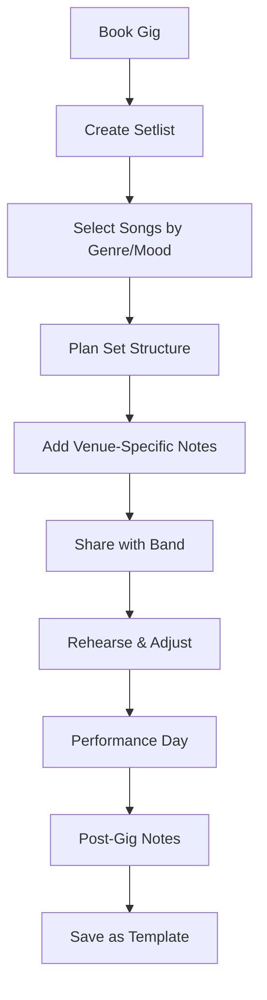

# Musician Features Overview 🎵

## Core Features Built for Performers

### 🎼 Professional Song Management

**Smart Library Organization**
- **BPM Tracking**: Accurate tempo ranges (40-250 BPM) for mixing and flow planning
- **Musical Keys**: Standard notation (C, C#/Db, D, etc.) with major/minor support  
- **Genre Classification**: Authentic categories (Classic Rock, Jazz Standards, Wedding Classics)
- **Difficulty Ratings**: 1-5 scale for skill assessment and band member assignments
- **Performance Notes**: Custom fields for chords, lyrics, special instructions, sound engineer notes

**Realistic Musical Data**
```yaml
Sample Songs Included:
  "Bohemian Rhapsody" - Queen:
    BPM: 72
    Key: Bb Major  
    Duration: 5:55
    Genre: Classic Rock, Opera
    Difficulty: 4/5
    Notes: "Piano intro, opera section at 2:35, guitar solo at 4:20"
    
  "Take Five" - Dave Brubeck:
    BPM: 176
    Key: Bb Major
    Duration: 5:24
    Genre: Jazz, Instrumental
    Time Signature: 5/4
    Difficulty: 5/5
    Notes: "Complex time signature, feature drum and piano solos"
```

### 📋 Professional Setlist Creation

**Performance Planning Tools**
- **Venue Information**: Store venue-specific notes (sound system, stage size, restrictions)
- **Date & Time Tracking**: Schedule management with multiple shows
- **Expected Duration**: Automatic calculation with manual override capability
- **Set Structure**: Support for multiple sets with intermission planning

**Advanced Organization**
```yaml
Setlist Structure:
  Main Set (60 minutes):
    Opener: High-energy crowd engagement
    Build: Mix of originals and familiar covers
    Peak: Crowd favorites and singalongs
    Wind-down: Prepare for encore or closing
    
  Encore (15 minutes):
    Fan Favorites: "Don't Stop Believin'", "Sweet Caroline"
    
  Backup Songs:
    If Short: "Mr. Brightside" (3:42)
    If Crowd Requests: "Wonderwall" (4:18)
```

**Transition Management**
- **Between-Song Notes**: Timing, banter, instrument changes
- **Key Flow Planning**: Minimize jarring key changes  
- **Energy Arc**: Build and release tension throughout the show
- **Technical Notes**: Equipment changes, sound adjustments

### 🎯 Performance-Day Features

**Mobile-Optimized Interface**
- **Large Touch Targets**: 44px minimum for backstage use
- **High Contrast Mode**: Readable in low-light venue conditions
- **Quick Access**: Song lookup without scrolling through entire library
- **One-Handed Operation**: Control with thumb while holding instrument

**Offline Reliability**
```yaml
Critical Offline Features:
  ✅ View complete setlists
  ✅ Access song details and notes  
  ✅ Mark songs as completed
  ✅ View transition notes
  ✅ Emergency song lookup
  
Requires Internet:
  ❌ Adding new songs
  ❌ Creating new setlists
  ❌ Syncing changes across devices
```

**Real-Time Performance Tracking**
- **Progress Indicator**: Visual progress through the setlist
- **Time Remaining**: Automatic calculation based on completed songs
- **Flexible Adjustments**: Skip, reorder, or add songs on the fly
- **Crowd Response Notes**: Rate audience engagement for future reference

### 🤝 Collaboration Features

**Band Member Management**
- **Role-Based Access**: Leader, Member, Viewer permissions
- **Individual Libraries**: Personal song collections with shared band setlists
- **Version Control**: Track changes and revert if needed
- **Communication**: Comments and suggestions on setlist items

**Professional Sharing**
```yaml
Export Formats:
  PDF: Clean format for sound engineers and venue staff
  JSON: Complete backup for importing into other instances
  Text: Simple format for quick sharing via email/text
  Print: Optimized layout for physical copies

Sharing Recipients:
  Sound Engineer: Technical requirements and stage plot
  Venue Manager: Timing, special requirements, licensing info
  Band Members: Individual parts, chord charts, lyrics
  Booking Agent: Set length, crowd appeal ratings
```

### 🎨 User Experience Design

**Accessibility First**
- **WCAG 2.2 AA Compliance**: Professional accessibility standards
- **Screen Reader Support**: Full functionality with assistive technology
- **Keyboard Navigation**: Complete app control without mouse
- **Motor Accessibility**: Large buttons, forgiving touch targets
- **Cognitive Accessibility**: Clear information hierarchy, reduced cognitive load

**Musician-Friendly Design**
```yaml
Design Principles:
  Backstage Environment: Works in poor lighting conditions
  Quick Access: Find any song in under 3 seconds
  No Learning Curve: Intuitive for musicians who aren't tech-savvy
  Error Prevention: Confirmations for destructive actions
  Fast Recovery: Undo actions, restore deleted items
```

### 🔄 Workflow Integration

**Practice Session Support**
- **Rehearsal Mode**: Track which songs need work
- **Notes During Practice**: Real-time feedback capture
- **Tempo Adjustments**: Practice at slower speeds, note performance tempo
- **Member Assignments**: Track who plays what parts

**Gig Planning Workflow**


### 📊 Analytics & Insights

**Performance Analytics**
- **Song Popularity**: Track crowd response across venues
- **Venue Success**: Which songs work best at different locations
- **Set Length Optimization**: Actual vs. planned performance times
- **Energy Flow**: Analyze BPM progression and crowd engagement

**Professional Reporting**
```yaml
Generated Reports:
  Setlist Statistics: Average length, most played songs, genre distribution
  Venue Analysis: Best songs for specific venues, crowd preferences
  Performance Trends: Seasonal favorites, regional preferences  
  Band Development: Skill progression, repertoire growth tracking
```

### 🔧 Technical Features for Musicians

**Audio Integration (Coming Soon)**
- **Click Track Generation**: Metronome sync for rehearsals
- **Backing Tracks**: Integration with audio files
- **Live Recording**: Capture performances for review
- **Sound Check**: Technical requirements and stage plots

**Equipment Management**
```yaml
Technical Notes Support:
  Instruments: Guitar tunings, keyboard patches, drum kit setup
  Effects: Pedal settings, amp configurations
  Microphones: Vocal setup, instrument micing
  Stage Plot: Equipment positioning, cable runs
```

## 🎯 Real Musician Success Stories

### Solo Acoustic Artist
*"I used to fumble with paper setlists between songs. Now I can adjust my set based on the crowd in real-time, and the offline mode saved me during a venue internet outage."* - Sarah, Folk Singer

### Wedding Band
*"Managing 4-hour wedding receptions became so much easier. We can plan dinner music, first dance, and party sets all in one place. The BPM tracking helps us maintain perfect energy flow."* - Mike, Wedding Band Leader

### Jazz Ensemble
*"The complex time signature support and authentic jazz standards database made our club residency planning effortless. We can now focus on music instead of paperwork."* - Davis, Jazz Pianist

### Rock Cover Band
*"Setlist Studio transformed our rehearsals. Everyone knows exactly which songs we're working on, and the difficulty ratings help us assign parts based on each member's skill level."* - Alex, Rock Band Guitarist

---

**Ready to streamline your musical performances?** 🎸

*Professional setlist management built by musicians who understand your workflow.*